## About Me

- I’m always on the lookout to try and test **everything** — whether it’s *tech-related* or something *in real life*, I like having at least a little knowledge about it.  
- **A popular line in my tone?** `jack of all trades, still finding the one worth mastering.`  
- [**Want to reach me?**](#connect-with-me)  

     

## ~Skills~ Knowledge / Learning 
*(Having only a plenty of knowledge and calling it a skill would be such a shame)*  

- **Languages:** Python · Java · Kotlin · HTML
- **Frameworks:** Android SDK  
- **Tools:** Git · NeoVim · Termux 

## Projects

Here are some of the projects I've worked on:  

- [LetsWatch](https://github.com/rhydinlioren/letswatch) - Watch videos together in synchronized rooms. `WIP`
- [Tailscale - No Sudo](https://github.com/rhydinlioren/tailscale-nosudo) – Run Tailscale VPN inside linux machines without sudo privileges.  
- [Project 69](https://github.com/rhydinlioren/project69) - Sets of backup/startup scripts for Github Codespaces.

## GitHub Stats

## Connect with Me

